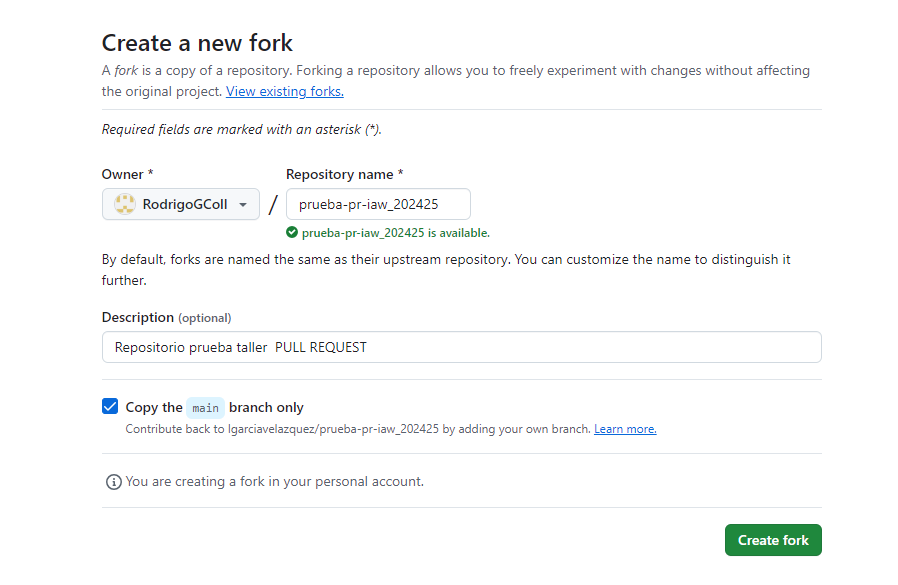
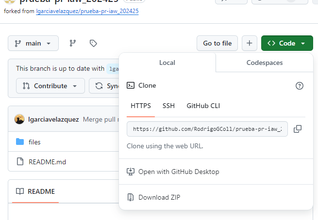

# Ejercicio 4: Git. Colaborar en un proyecto de software libre. Pull Request (PR)

>En el nombre del repositorio pongo el asignado en la tarea

>Una vez dentro de la cuenta de Luis copio el código

>Una vez en la carpeta de IAW lo clono

>En los archivos del repositorio pongo un md con mis iniciales.

>Pongo el mensaje en mi md con los datos que se solicitan.
 

>Añando mis iniciales al final.

>Una vez dentro del repositorio lo añado con los comandos que se ven en la imágen.

>Me cambio a la rama del ejercicio 4 y lo subo con git push.

>Añado el título del intercambio.

>Esta es la captura de confirmación de que funciona.

